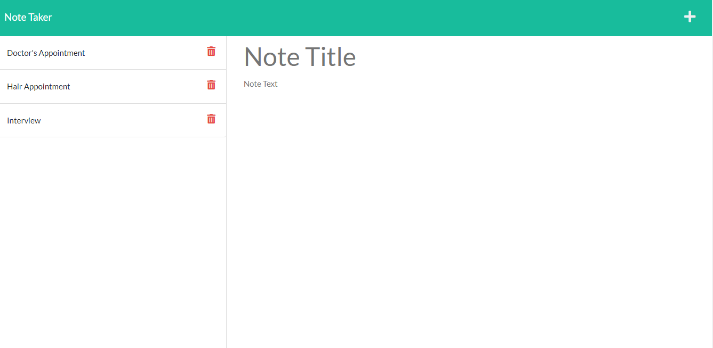

# Note Taker

## Table of Contents
- [Description](#description)
- [Installation](#installation)
- [Usage](#usage)
- [Application](#application)
- [Images](#images)
- [Full Video Demo](#full-video)
- [License](#license)
- [Contributing](#contributing)
- [Tests](#tests)
- [Questions](#questions)
- [Copyright](#copyright)

## Description
Note Taker that can be used to write and save notes. This application will use an Express.js back end and will save and retrieve note data from a JSON file.

## Installation

Follow these steps to install this project on your local machine.

- Open Bash editor
- mkdir nodeTaker
- cd nodeTaker
- git clone https://github.com/Altheahanson/NoteTaker.git
- npm install

## Usage
After cloning this repository...
Production Mode: Open bash terminal - npm start
Developer Mode: Open bash terminal - npm run dev

## Application

Link to Deployed Application: 
https://powerful-thicket-42630.herokuapp.com/notes

## Images
- 

## Tests
Email Me

## Questions
- Username: Althea Hanson 
- https://github.com/altheahanson
- Please contact me for additional questions 
- altheacarlenehanson@gmail.com

## Contributing
Email Me

## License
- This project is govern under the General Public v3.0 License

## Copyright
   (c) Copyright 2022 Althea Hanson 